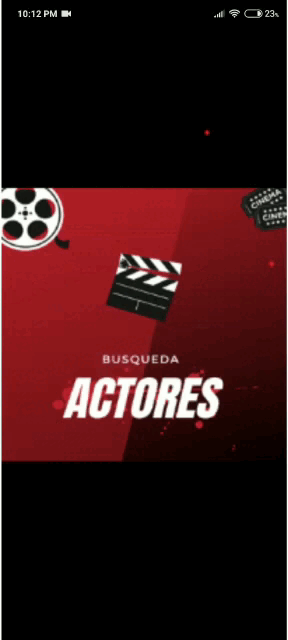

# Aplicación para realizar busqueda por medio de imagen

Apk de la aplicacion: https://expo.dev/artifacts/512d050e-927e-4011-8e43-24ced68910df




### Pasos para ejecutar el proyecto
 

* Clonar el proyecto
```
git clone https://github.com/AngelAlbertoDeLaCruzGarcia/Actores.git
```
* Instalar los paquetes
```
npm install
```
* Ejecutar el proyecto
```
expo start
```

## Librerias usadas en el proyecto

* [Redux](https://github.com/reduxjs/react-redux) 
* [Expo image picker](https://www.npmjs.com/package/expo-image-picker)
* [React Navigation](https://github.com/react-navigation)
* [React Native Button Sheet](https://www.npmjs.com/package/react-native-sheet)
* [Axios](https://github.com/axios/axios)


## Autor

* **Angel Alberto De La Cruz Garcia** - [FB](https://www.facebook.com/angel.cruz.547389)


